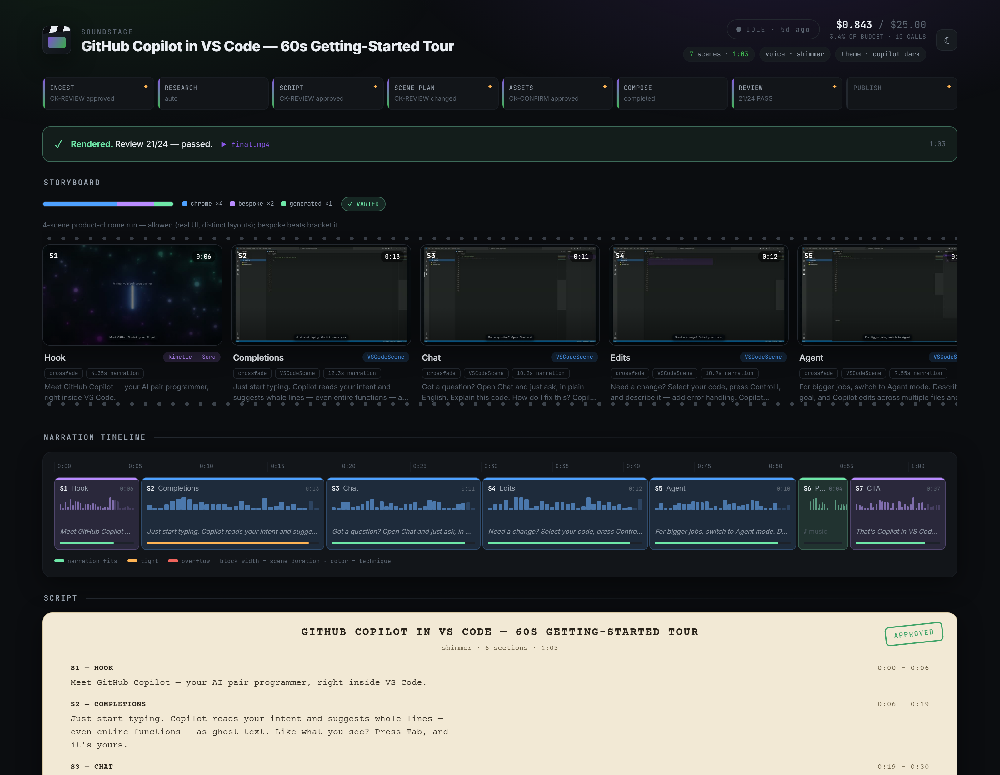
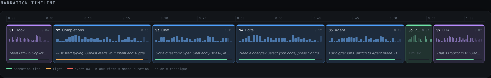
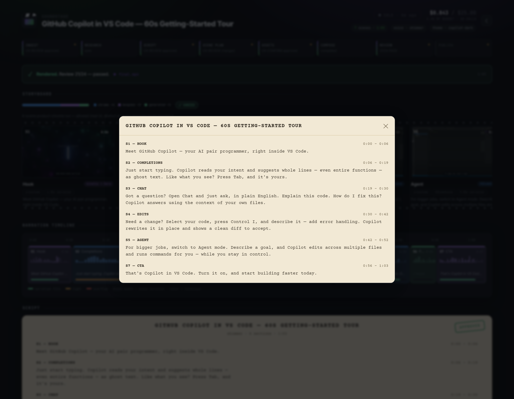
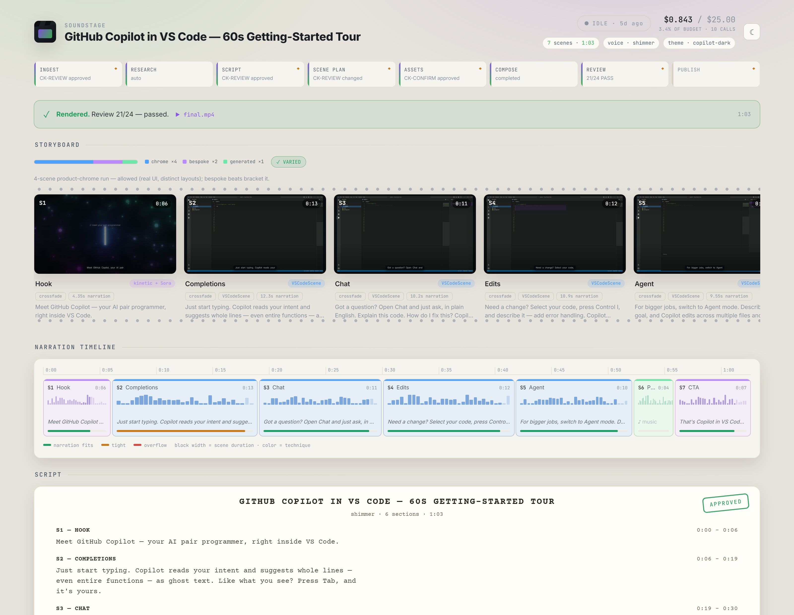
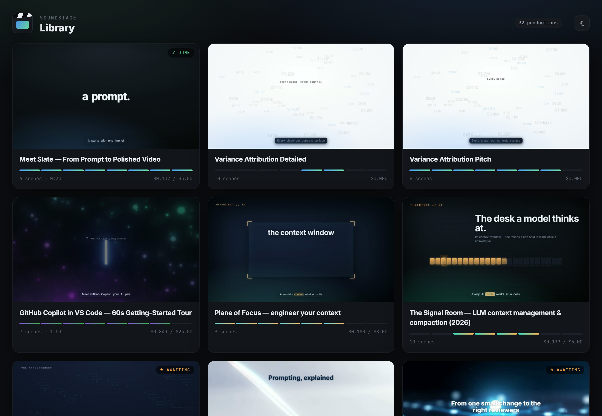

# Slate

### The AI that directs your videos.

> One detailed prompt. Professional video. No timeline editors, no render farms, no video team.

Slate is an agentic video production engine built for the **GitHub Copilot ecosystem**. It runs inside any Copilot-enabled environment — VS Code with GitHub Copilot Chat, Copilot CLI, or JetBrains with Copilot — where the assistant can access the filesystem, run terminal commands, and interact with Azure via `az`. Describe what you need in plain English — Slate scripts it, generates every asset, composes the visuals, adds narration, enforces your brand, reviews its own work, and delivers a polished MP4.

---

## 🎥 What Can Slate Make?

Slate produces a wide range of professional videos. Here are some examples by role:

| Role | Video types |
|------|------------|
| **PMs & Product Marketing** | Feature launches, release recaps, roadmap walkthroughs, competitive overviews |
| **Engineers & Tech Leads** | API explainers, architecture walkthroughs, CLI/terminal demos, code review summaries |
| **Customer Success & FastTrack** | Onboarding tutorials, workflow demos, customer success stories |
| **Sales & Solution Engineering** | Product demos, ROI presentations, competitive matrices, pricing walkthroughs |
| **Executives** | Org updates, launch messages, strategy recaps, town hall intros |
| **Training & Readiness** | Step-by-step lessons, compliance training, policy walkthroughs, quizzes |
| **Security & Compliance** | Incident response overviews, audit evidence, data flow diagrams, compliance badge walls |
| **Internal Comms** | Team wins recaps, culture spotlights, event summaries |

### Key capabilities

- **Turn a prompt, deck, or doc into a video** — drop in a PPTX, DOCX, or just describe what you want
- **Synthetic UI demos** — show product workflows without screen recording (Teams, Outlook, VS Code, Azure Portal, GitHub, Excel, PowerPoint, and 10+ more)
- **AI-generated imagery** — photorealistic people, environments, creative illustrations
- **AI video clips** — Sora-2 motion footage for cinematic moments
- **Deterministic structured visuals** — code blocks, charts, diagrams, tables rendered pixel-perfect (never hallucinated)
- **Professional narration** — 6 AI voices with cinematic, corporate, or conversational tones
- **Brand enforcement** — your colors, fonts, logo, and voice from a YAML brand package
- **80+ motion-graphics components** — from brand intros to metrics cards to compliance badge walls

For detailed examples by role with sample prompts, see [docs/EXAMPLE_USE_CASES.md](docs/EXAMPLE_USE_CASES.md).

### 🎬 Demo

https://github.com/user-attachments/assets/ee85370d-f6de-4c63-8a8f-e806cf7d3757

---

## 🎬 Watch It Happen — Soundstage, the Living Storyboard

Chat tells you what the agent *said*. **Soundstage shows you what the production
is actually doing** — a local, read-only board that fills itself in as the
pipeline runs. When a production starts, the agent opens it for you
automatically; it derives everything from the project files Slate already writes
(`decisions.jsonl`, `ledger.jsonl`, the SCF, renders), so there's no reporting
step and nothing to keep in sync.

<p align="center"></p>

**The storyboard is a Figma-style scene wall with a video-editor narration
timeline underneath.** Each block is scaled to its scene's real duration, shows
the spoken line, and turns amber/red when narration overruns the shot — so
pacing problems are visible *before* you render. A **Variety Meter** reads each
scene's technique and flags sameness.

<p align="center"></p>

**The script lands as a cream screenplay page** with an approval stamp; long
scripts stay compact and expand into a modal. Approval **gates** are impossible
to miss, and every creative decision — model picks, retries, "also considered"
roads not taken — stays on the wall as a **decision trail**.

<p align="center"></p>

**Light and dark**, and each board is tinted with the video's own theme:

<p align="center"></p>

**A library across every production** — live, awaiting review, or delivered:

<p align="center"></p>

You never start it manually during normal use — the agent runs it at project
creation (idempotent, non-fatal; the board is an observer, never a blocker). To
open it yourself:

```powershell
python -m slate.soundstage open <slug>     # a project board (starts the server if needed)
python -m slate.soundstage open            # the library (all productions)
```

Soundstage is read-only by design: agents and tools write the source of truth to
disk; the board renders that truth. Design doc:
[docs/design/LIVING_STORYBOARD.md](docs/design/LIVING_STORYBOARD.md). It is a
clean-room reimagining of **Backlot**, the living storyboard from
[OpenMontage](https://github.com/calesthio/OpenMontage/pull/273) (same author) —
reimplemented against Slate's append-only state contract and extended (SCF-native
storyboard, narration timeline, variety meter, provenance trail). See
[NOTICE.md](NOTICE.md).

---

## ✨ What Makes Slate Different

### 🎬 Agent-as-Director
Your AI assistant doesn't just help — it **directs**. Slate gives the agent creative judgment: shot composition, pacing, narrative flow, color choices. It thinks like a filmmaker, not a code generator.

### 🖼️ Powerful Image Generation
**gpt-image-2** handles all AI image generation — photorealistic faces, environments, creative art, text-in-image, and 4K output. One model that excels at everything.

Plus **Sora-2** for AI-generated video clips and **Azure AI Speech** for studio-quality narration — the full neural-HD voice catalog (700+ voices across 150+ locales, with real word-level caption timing). **gpt-4o-mini-tts** is the built-in fallback.

### 📊 Component-First Visuals — No Static Fallbacks
Flow diagrams, data charts, metrics cards, step-by-step guides, comparison tables — all rendered as **animated HyperFrames+GSAP components** with glassmorphic styling and motion. If a component doesn't exist for your content type, Slate creates one on the fly via a sub-agent. No static PNGs in your videos.

### 🛡️ Enterprise Governance Built In
- **2-Agent Architecture** — Director creates, Reviewer sub-agent audits independently
- **Append-only audit trail** — Every tool call, cost, and decision recorded
- **Brand enforcement** — Colors, fonts, logos, voice guidelines from YAML
- **8-dimension quality rubric** — Videos reviewed by independent sub-agent before delivery
- **Pre-compose validation** — Narration overflow, black frames, and missing assets caught before render
- **Content moderation** — Azure AI Video Indexer flags unsafe content
- **Budget gates** — Pre-flight cost estimates, 90% budget warnings, hard caps

### 💰 Transparent, Predictable Costs
Every API call is tracked and estimated upfront. A typical 60-second explainer costs **~$0.25–$0.50**. You see the estimate before a single dollar is spent.

### 🚀 Zero-Friction Onboarding
First time? Slate detects what's missing, presents a deployment plan, and can provision Azure AI models using your signed-in Azure subscription after you approve the changes. No silent resource creation. No hidden charges. The agent should show the plan first, then wait for your confirmation.

---

## Quick Start

### Recommended: VS Code + GitHub Copilot

```powershell
git clone https://github.com/gim-home/SlateStudio.git
cd SlateStudio
.\setup.ps1        # checks/installs runtime prerequisites and project deps
```

Then open the folder in VS Code with GitHub Copilot enabled and start working with Slate through Copilot Chat.

Recommended agent models for Slate sessions:

- **GPT-5.5 (Medium)**
- **Opus 4.6 (1M context, Medium)**

`setup.ps1` is idempotent — run it again anytime to verify your environment.

> **⚠️ IMPORTANT — Azure AI Foundry models required.**
> Slate uses Azure AI Foundry to generate images, narration, and video clips. To produce videos, you need the following model deployments on an Azure AI Foundry resource:
>
> | Model | What it does | Required? |
> |-------|-------------|-----------|
> | **gpt-image-2** | All AI image generation (faces, scenes, creative, text-in-image) | Yes — for any video with generated images |
> | **gpt-4o-mini-tts** | Text-to-speech narration (6 voices) | Yes — for any video with narration |
> | **gpt-4o-transcribe** | Speech-to-text with word-level timestamps (captions) | Optional — for word-highlight captions |
> | **Sora-2** (`sora`) | AI-generated video clips (4/8/12s) | Optional — for motion scenes |
>
> **If these models are not deployed**, Slate will detect what's missing on first use and present a deployment plan. After you approve, it provisions the models using your signed-in Azure subscription (`az login`). No resources are created without your explicit confirmation.
>
> `setup.ps1` installs local prerequisites (Node.js 24+, Python 3.11+, FFmpeg, project dependencies). Azure model deployment happens separately through the agent on first use.

### Manual Setup

```bash
git clone https://github.com/gim-home/SlateStudio.git
cd SlateStudio
python -m pip install -e .
python -m pip install openai azure-identity python-pptx python-docx openpyxl
cd render && npm install && cd ..
```

**Prerequisites:** Node.js 24+, Python 3.11+, FFmpeg. For Azure-backed generation, Azure CLI (`az login`) is also required.

Once Copilot is running with the Slate repo loaded, just describe your video:

```
Create a 60-second product launch video for Azure AI Foundry
```

Slate handles the rest: scripting → asset generation → composition → review → delivery.

Want more control? Just say so naturally:

```
Create a 90-second onboarding tutorial for new engineers.
Use the Contoso brand package, coral voice, cinematic style.
```

---

## How It Works

```
 Prompt ──→ [Ingest] ──→ [Script] ──→ [Scene Plan] ──→ [Assets] ──→ [Compose] ──→ [Review] ──→ MP4
              ↑              ↑              ↑                                          ↑
          User approval  User approval  User approval                           AI self-review
                                                                              + Video Indexer
```

Every stage boundary is a **human-in-the-loop checkpoint**. The agent presents its work, you approve (or redirect), and it continues. Creative decisions happen inside stages. Governance happens at the gates.

---

## The Twelve Principles

| # | Principle | In Practice |
|---|-----------|-------------|
| 1 | **Agent-as-Director** | The AI makes creative decisions, not just executes |
| 2 | **Capability Manifest Awareness** | Always checks available tools before claiming limitations |
| 3 | **Deterministic Workflow** | Agentic loop with fixed checkpoints; creative freedom within each step |
| 4 | **SCF-First Composition** | Visual composition via HyperFrames; FFmpeg only for audio/transcoding |
| 5 | **Deep Artifact Understanding** | Analyzes every input file before using it |
| 6 | **Review via Sub-Agent** | 8-dimension automated QA by independent reviewer before delivery |
| 7 | **Human-in-the-Loop** | Asks at stage boundaries, not every step |
| 8 | **Tool Creation as Escape Hatch** | Missing capability? Builds a new tool on the fly |
| 9 | **Single-Responsibility Tools** | One tool, one job, composable |
| 10 | **Externalized State** | All pipeline state on disk, never only in memory |
| 11 | **Progressive Disclosure** | Simple defaults first, full power on request |
| 12 | **Fail Forward** | Never fails silently; always explains and offers alternatives |

---

## Architecture at a Glance

```
┌─────────────────────────────────────────────────────────┐
│                    AI Coding Assistant                   │
│               (GitHub Copilot / Claude / etc.)          │
│                   ┌──────────────┐                      │
│                   │  Director    │ <- Skills (Markdown)  │
│                   │  Agent       │ <- Agentic Loop       │
│                   └──────┬───────┘                      │
├──────────────────────────┼──────────────────────────────┤
│  Slate Engine            │                              │
│  ┌───────────────────────▼────────────────────────┐     │
│  │ TracedDispatcher (cost tracking + audit trail) │     │
│  └───┬────────┬────────┬────────┬────────┬────────┘     │
│      │        │        │        │        │              │
│  ┌───▼──┐ ┌──▼───┐ ┌──▼──┐ ┌──▼───┐ ┌──▼────┐         │
│  │Image │ │ TTS  │ │Video│ │HyprFr│ │Review │         │
│  │Gen   │ │Gen   │ │Gen  │ │Render│ │Agent  │         │
│  └──────┘ └──────┘ └─────┘ └──────┘ └───────┘         │
├─────────────────────────────────────────────────────────┤
│  Azure AI Foundry          │  Local                     │
│  - gpt-image-2             │  - 80+ GSAP components     │
│  - gpt-4o-mini-tts         │  - FFmpeg (audio/transcode)│
│  - Sora-2                  │  - HyperFrames (renderer)  │
│  - gpt-4o-transcribe       │  - Design intelligence     │
└─────────────────────────────────────────────────────────┘
```

For the complete technical deep-dive, see [docs/ARCHITECTURE.md](docs/ARCHITECTURE.md).

---

## Tech Stack

| Layer | Technology | License |
|-------|-----------|---------|
| Orchestration | AI Coding Assistant + Markdown Skills | — |
| Rendering | [HyperFrames](https://github.com/HeyGen-Official/hyperframes) | Apache-2.0 |
| Image Gen | Azure AI Foundry (gpt-image-2) | Azure API |
| Voice | Azure AI Foundry (gpt-4o-mini-tts) | Azure API |
| Video Gen | Azure AI Foundry (Sora-2) | Azure API |
| Analysis | Azure AI Video Indexer | Azure API |
| Structured Viz | Pillow | HPND (permissive) |
| Audio/Video | FFmpeg | LGPL-2.1 |
| Transcription & Subtitles | Azure AI Foundry (gpt-4o-transcribe) | Azure API |
| Framework | Python 3.11+ / Node.js 24+ | — |

See [docs/TOOL_LICENSING_INFO.md](docs/TOOL_LICENSING_INFO.md) for the full licensing analysis.

---

## 📚 Documentation

| Document | Description |
|----------|-------------|
| [docs/ARCHITECTURE.md](docs/ARCHITECTURE.md) | Complete technical architecture — framework, tools, SCF, rendering, governance |
| [docs/EXAMPLE_USE_CASES.md](docs/EXAMPLE_USE_CASES.md) | Detailed use cases by role with sample prompts |
| [docs/COMPONENT_REFERENCE.md](docs/COMPONENT_REFERENCE.md) | Full prop contracts for all HyperFrames components |
| [docs/COMPONENT_CATALOG.md](docs/COMPONENT_CATALOG.md) | Quick-reference catalog — what each component does and when to use it |
| [docs/TOOL_ONBOARDING.md](docs/TOOL_ONBOARDING.md) | Guide to creating new BaseTool implementations |
| [docs/TOOL_LICENSING_INFO.md](docs/TOOL_LICENSING_INFO.md) | Third-party dependency licensing analysis |
| [NOTICE.md](NOTICE.md) | Attribution for HyperFrames, OpenMontage, and GSAP |
| [skills/INDEX.md](skills/INDEX.md) | Skill directory — the agent's knowledge base |

---

## Inspiration & Attribution

Slate's architecture draws conceptual inspiration from
[OpenMontage](https://github.com/calesthio/OpenMontage) (AGPL-3.0), an
open-source agentic video production framework by the same author.
Architectural patterns were reimagined from scratch for Azure-native
enterprise requirements. **No OpenMontage source code is present in Slate.**
See [NOTICE.md](NOTICE.md) for the full attribution notice.

---

**License:** Proprietary

---

## ❓ Frequently Asked Questions

**Why isn't this an M365 Copilot agent?**
Slate isn't a conversational plugin — it's an entire production ecosystem. The agent harness alone includes **100 skill documents** (80 core/component contracts, 12 meta-operational skills, 4 director archetypes, 3 model-specific guides), **18 single-responsibility tools**, **64 motion-graphics components**, a **1,400-line JSON schema**, brand package enforcement, append-only audit trails, cost governance, and a 2-phase review system with an independent reviewer sub-agent. At runtime it orchestrates headless Chrome, FFmpeg, Python, and Node.js — writing hundreds of frames to disk, mixing audio, and encoding video. That's a build-system-level workload requiring full filesystem and terminal access. M365 Copilot agents run in a sandboxed cloud environment with no local process execution, no filesystem, and no ability to run Chrome or FFmpeg. Slate is designed for coding assistants (VS Code Copilot, Copilot CLI) that have full system access.

**How much does a video cost?**
From **`$0`** (component-only videos with structured visuals, no AI generation) to **~`$2.50`** for a 60-second explainer with AI-generated images and a few Sora-2 video clips. The agent shows cost estimates before spending and enforces budget caps.

**What data goes to Azure?**
Image prompts, narration text, and video prompts are sent to Azure AI Foundry models in your subscription. Rendered MP4s can optionally be sent to Azure Video Indexer for quality review. No data is sent anywhere else. All generated assets stay on your local disk.

**Can I use this for external/customer-facing content?**
Not yet. Slate is in its **early development phase** and is intended for **internal testing and showcasing only**. Third-party dependency licensing has been evaluated using LLM-assisted analysis but has **not been reviewed with Microsoft Legal**. Do not use for external distribution without legal review.

**Can I use my own images, videos, or audio?**
Yes. Drop files into the project's `assets/` folder and reference them in your prompt. Slate analyzes them (dimensions, duration, codec) before using them.

**How long does a video take to produce?**
Typically **5–20 minutes** end-to-end, depending on video complexity, number of AI-generated assets, and the back-and-forth with the agent during approval checkpoints. Simpler videos with fewer scenes finish faster.

**Can I run this without Azure (fully local)?**
Partially. Structured visuals (code, charts, diagrams) and component-based scenes render locally for free. But AI image generation, narration, and video clips require Azure AI Foundry models.

**Can I edit the video after generation?**
Yes — just ask the agent to make the changes you want. It will update the affected scenes, regenerate assets if needed, and re-render. You stay in control through the same approval flow.

**What are the third-party dependencies?**
HyperFrames (Apache-2.0) for rendering, GSAP (standard license) for animation, Pillow (HPND) for structured visuals, FFmpeg (LGPL-2.1) for audio/video processing. Full analysis in [docs/TOOL_LICENSING_INFO.md](docs/TOOL_LICENSING_INFO.md).

**Why local rendering instead of a cloud service?**
Development velocity — iterate on components and test renders without deploying infrastructure. Also gives full cost control (no per-render service fees) and keeps all content on the developer's machine.

**What is SCF?**
SCF (Slate Composition Format) is a declarative JSON document that describes an entire video — scenes, components, layers, narration, transitions, music, and brand settings — in a single file. Think of it as a "recipe" that separates *what* the video should look like (creative decisions) from *how* it gets rendered (technical execution). This means you can validate, diff, and version-control a video the same way you do code. The agent generates it; the renderer consumes it; you never need to touch it directly.

**How does Slate create product demos without screen recording?**
Slate includes 18+ **synthetic UI components** that faithfully reproduce the look and feel of real applications — Teams, Outlook, VS Code, Azure Portal, GitHub, Excel, PowerPoint, Edge, and more. The agent describes what should happen (e.g., "an email arrives in Outlook, user clicks it, then replies"), and the component renders a pixel-accurate mockup with animated steps — typed text, button clicks, tab switches, panel reveals — all driven by GSAP animation timelines. No actual app is running; no screen is being recorded. The result looks like a polished screen recording but is fully deterministic, brandable, and reproducible.

**Why HyperFrames instead of Remotion or raw FFmpeg?**
Three reasons. First, **FFmpeg is imperative** — you'd chain filter_complex commands for every scene, with no schema validation, no component reuse, and no way to diff or reproduce a composition. Slate uses FFmpeg only for what it's good at: audio mixing, probing, and transcoding. Second, **Remotion requires writing React code** for every scene — the agent would need to generate, bundle, and debug JSX at runtime. That's fragile and slow. HyperFrames takes a different approach: **HTML + CSS + GSAP timelines captured frame-by-frame** by headless Chrome. The agent generates declarative JSON (SCF), the compiler turns it into a single HTML file with paused timelines, and the producer captures frames deterministically. No React bundling, no runtime JavaScript execution during capture — just DOM snapshots. Third, HyperFrames is **Apache-2.0 licensed** with no per-render fees, which matters for enterprise adoption.

**What about content moderation?**
Slate has multiple layers. Azure AI Foundry models (gpt-image-2, Sora-2) apply their own built-in content safety filters at generation time — prompts that violate safety policies are rejected before any content is created. Post-render, the optional **Azure AI Video Indexer** deep review scans the finished video for adult/racy/violence content at the shot level and flags anything above threshold. If a moderation flag fires, the reviewer blocks delivery and escalates to the user. The governance policy (`config/org/governance-policy.yaml`) also defines blocked content categories enforced throughout production.

**What happens if an API call fails mid-production?**
Slate follows **Principle 12: Fail Forward with Transparency**. If an image generation call fails, the agent tells you what happened and offers alternatives (retry, use a different prompt, or use a placeholder). If Sora-2 is unavailable, it falls back to a static image with Ken Burns motion. If TTS fails, it reports the error and lets you retry. No content is ever silently dropped — every failure is logged in the project's decision log and surfaced to you.

**What resolutions and formats does Slate support?**
Four output profiles: **draft** (720p/24fps), **standard** (1080p/30fps), **high** (1080p/30fps, higher bitrate), and **ultra** (4K/30fps). Output is H.264 MP4 by default. The SCF schema also supports H.265, ProRes, and VP9 codecs. Aspect ratios include 16:9 (landscape), 9:16 (vertical/social), and 1:1 (square).

**Can I add my own components?**
Yes. Create a folder under `render/components/<YourComponent>/` with three files: `index.html` (structure + Mustache templates), `style.css` (scoped styles), and `animation.js` (paused GSAP timeline). Register the component name in the SCF schema. The full authoring contract is in [docs/COMPONENT_REFERENCE.md](docs/COMPONENT_REFERENCE.md) and the step-by-step guide is in [docs/TOOL_ONBOARDING.md](docs/TOOL_ONBOARDING.md).
