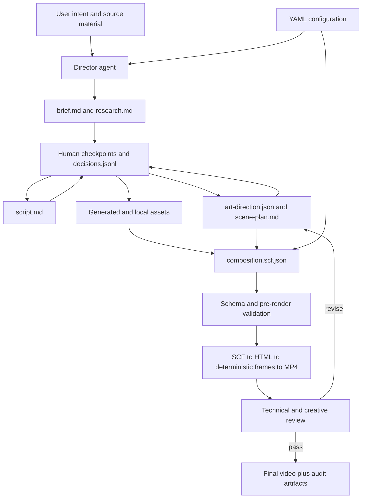

# Creativity and Determinism in Slate

## Purpose

Slate is designed to solve a tension that appears in most agentic media
systems:

- A video needs creative judgment to be interesting, coherent, and appropriate
  for its audience.
- A production system needs repeatable structure, controlled cost, exact text,
  reliable timing, governance, and an audit trail.

Slate does not solve this by making the agent choose from a rigid template.
Instead, it progressively turns creative decisions into approved, persisted,
machine-checkable artifacts. The key handoff is the **Slate Composition Format
(SCF)**: creative intent becomes an explicit timeline that the renderer can
execute deterministically.

In one sentence:

> The agent decides what the video should mean and feel like; YAML, project
> artifacts, SCF, validators, and the renderer constrain how those decisions are
> recorded and executed.

---

## Important Architecture Correction

Slate originally used YAML pipeline manifests under `pipeline_defs/`. Those
manifests and the fixed pipeline state machine were removed during the agentic
refactor.

The current system does **not** use YAML to define a fixed sequence such as
"stage 1, then stage 2, then stage 3." The current production sequence is
driven by:

1. The agentic playbook in
   [`skills/meta/production-loop.md`](../skills/meta/production-loop.md).
2. Just-in-time director and craft skills under [`skills/`](../skills/).
3. Human checkpoints recorded in `decisions.jsonl`.
4. Concrete files in `projects/<slug>/`.
5. SCF as the executable composition contract.

YAML still matters, but it now configures the **boundaries** around production:
models, cost, brand, governance, Azure resources, and music metadata.

---

## The Mental Model

Think of Slate as two cooperating systems.

| Creative director | Deterministic production engine |
|---|---|
| Understands audience and desired outcome | Requires explicit files and schemas |
| Writes the narrative and chooses pacing | Uses measured scene and audio durations |
| Invents an art direction | Loads approved model, brand, and policy configuration |
| Selects a visual technique for each scene | Resolves exact components, props, layers, and assets |
| Decides when generated media adds value | Validates asset existence and media compatibility |
| Revises work after critique | Compiles one SCF timeline into repeatable frames |
| Explains tradeoffs to the user | Records costs, decisions, hashes, and render results |

Neither side is sufficient by itself:

- Creativity without contracts produces attractive but inconsistent or
  unreviewable output.
- Determinism without creative direction produces technically correct slide
  decks that all look alike.

---

## End-to-End Flow



The left half of the flow is interpretive and collaborative. The right half
is increasingly concrete and deterministic.

---

## 1. Where Creativity Lives

### The agent is the director

The agent decides:

- Who the audience is.
- What the viewer should understand, feel, or do.
- Which facts and source materials matter.
- The narrative structure and spoken script.
- Scene count, pacing, and emphasis.
- The visual world, material, typography, and motion language.
- Which scenes use product chrome, generated imagery, video, SVG, Canvas,
  typography, or other techniques.
- Which candidate treatment is strongest after critique.

These are not values that a schema can choose intelligently. They require
context and taste.

### Creativity is persisted before it is rendered

Creative intent is written to files instead of remaining only in the model's
conversation context:

| Artifact | Creative question it answers |
|---|---|
| `brief.md` | Who is this for, and what should the video accomplish? |
| `research.md` | Which factual claims are verified, and from which sources? |
| `script.md` | What will the narrator say, in what order? |
| `art-direction.json` | What visual world, material, palette, composition, and motion language define this video? |
| `scene-plan.md` | What does each scene show, and how does it change over time? |
| `decisions.jsonl` | Why was each important choice made, approved, revised, or superseded? |
| `design-review.json` | Did the rendered scenes actually express the intended art direction? |

This is the first consistency mechanism: another session can reconstruct the
creative plan from disk without relying on hidden model memory.

### Art direction creates variety without chaos

[`skills/creative/art-direction.md`](../skills/creative/art-direction.md)
requires each video to define a coherent visual identity while assigning a
distinct technique to each scene.

The system deliberately separates two classes of visuals:

1. **Product chrome is reusable.** VS Code, Terminal, Teams, Outlook, Excel,
   Azure DevOps, browsers, and similar surfaces use established components so
   the software remains recognizable and accurate.
2. **Explanatory design is bespoke.** Diagrams, metaphors, hero moments,
   kinetic typography, and data stories are hand-composed from deterministic
   primitives so every video does not collapse into the same component catalog.

The result is controlled variety: scene treatments can differ, while palette,
material, typography, and motion rules hold the video together.

---

## 2. What YAML Controls

YAML defines organization-level configuration and constraints. It does not
contain the final scene timeline.

### Model registry

[`config/models.yaml`](../config/models.yaml) is the centralized model and
pricing registry. It describes:

- Deployment and provider names.
- Supported image sizes and quality levels.
- Valid Sora durations and resolution limits.
- Narration engines and fallback behavior.
- Transcription capabilities.
- Unit costs used for estimates and cost tracking.
- Optional analysis-service pricing.

This prevents each tool from inventing its own model names, capabilities, or
prices. The agent can choose a treatment, but the available model contract is
shared and reviewable.

### Governance policy

[`config/org/governance-policy.yaml`](../config/org/governance-policy.yaml)
defines organization-wide expectations such as:

- Default and hard budget limits.
- Human approval and independent-review requirements.
- Content-safety categories.
- Provider and data-residency preferences.
- Audit retention and hash requirements.
- Review dimensions and minimum scores.
- Allowed and forbidden runtime libraries.
- Skill-consultation policy.

The typed loader is
[`src/slate/core/governance_policy.py`](../src/slate/core/governance_policy.py).

### Brand packages

Brand YAML under [`config/org/brand-packages/`](../config/org/brand-packages/)
defines:

- Approved colors and typography.
- Logo location and placement requirements.
- Intro and outro treatment.
- Legal disclaimers.
- Approved voices and music sources.
- Compliance classification and approval chain.

[`BrandPackage`](../src/slate/core/brand_package.py) converts those values into
SCF-compatible props and CSS theme variables. The agent can invent a treatment,
but it should not silently override locked brand elements.

### Azure configuration

`config/azure.yaml` and the local override `config/azure.local.yaml` identify
the Azure resources and deployments tools can call. These files answer
"where does the capability run?" rather than "what should this scene look
like?"

Local Azure configuration may contain environment-specific information and
should not be treated as a creative artifact or copied into project output.

### Music manifest

[`assets/music/library/MANIFEST.yaml`](../assets/music/library/MANIFEST.yaml)
describes known music assets and their metadata. It makes music discovery
repeatable and helps avoid promising a track that is not present on disk.

---

## 3. The Project Folder Is Externalized Memory

Slate does not keep a mutable `pipeline_state.json`. Current state is inferred
from artifacts and append-only events.

```text
projects/<slug>/
  project.json
  brief.md
  research.md
  script.md
  scene-plan.md
  art-direction.json
  decisions.jsonl
  ledger.jsonl
  assets/
  components/
  composition.scf.json
  renders/
  review_context.json
  review_report.json
  design-review.json
  delivery.json
```

### Why append-only logs matter

`decisions.jsonl` and `ledger.jsonl` are append-only:

- A changed decision is a new event, not a rewritten history.
- A paid API call becomes a durable receipt.
- An approval can be tied to the artifact and estimated cost shown to the user.
- A render can be tied to the SCF path and output hash.
- A later session can see what is approved and what is still unresolved.

This gives creative work the same useful property as source control: history is
inspectable, and reversals do not erase the original decision.

### Checkpoints constrain autonomy

The agent has broad autonomy for cheap, reversible work such as drafting and
local validation. It must pause before paid generation, rendering, publishing,
or destructive replacement of prior outputs.

The checkpoint is both a conversation event and a persisted decision. That
keeps the human involved without requiring the human to operate every tool.

---

## 4. SCF Is the Executable Contract

The authoritative schema is
[`schemas/scf-v1.0.schema.json`](../schemas/scf-v1.0.schema.json).

SCF does not decide the story. It records the decisions required to execute the
story as a timeline.

At the top level, SCF fixes:

- Schema version and producing pipeline label.
- Output width, height, frame rate, codec, quality, and delivery profile.
- Ordered scenes.
- Music and caption behavior.
- Brand and audit metadata.

Each scene fixes:

- A stable ID.
- Duration in seconds.
- A reusable or project-scoped component, or a stack of primitive layers.
- Exact component props and asset paths.
- Narration audio and exact narration text.
- Narration offset.
- Transition.
- Optional notes describing creative intent.

Each layer fixes:

- Type: image, video, text, shape, caption, chart, component, or Lottie.
- Position and dimensions.
- Stacking order.
- Start and end time inside the scene.
- Content, source path, style, and entry animation.

### Components and layers serve different needs

```json
{
  "id": "product-demo",
  "duration": 10,
  "component": "VSCodeScene",
  "props": {
    "codeContentHtml": "...",
    "visualBeats": ["prompt", "edit", "test"]
  },
  "narration": "assets/narration/product-demo.wav",
  "narrationText": "The assistant edits the function and runs the test.",
  "transition": "crossfade"
}
```

A component scene uses tested behavior for a known visual surface. A layer
scene gives the agent lower-level composition control while keeping positions,
timing, and assets declarative.

Project-scoped components under `projects/<slug>/components/` provide a third
option: bespoke creative implementation with the same deterministic timeline
contract as shared components.

### SCF freezes generative choices into stable inputs

Image, narration, and video generation can be nondeterministic. Slate handles
that by generating assets first and then referring to the selected files from
SCF.

The renderer does not ask the image or video model to generate something again.
It consumes the approved file path. The creative generation is variable; the
selected production input is fixed.

---

## 5. How SCF Becomes a Repeatable Video

The render path is:

```text
SCF JSON
  -> JSON Schema validation
  -> pre-render media and quality validation
  -> delivery-profile governance gate
  -> SCF-to-HTML compilation
  -> one master HyperFrames/GSAP timeline
  -> headless Chromium frame capture
  -> FFmpeg encode and audio mix
  -> MP4 plus render audit record
```

### Structural schema validation

[`HyperFramesRender`](../src/slate/tools/video/hyperframes_render.py) validates
the complete SCF with `jsonschema` before it invokes Node. This catches unknown
top-level fields, invalid enums, missing required values, invalid dimensions,
and malformed component-specific props covered by the schema.

`SCFComposer.validate()` performs a smaller structural check. It is useful for
fast feedback, but it is not a replacement for full JSON Schema validation.

### Pre-render validation

[`scripts/lib/scf_validate.py`](../scripts/lib/scf_validate.py) checks facts
that JSON Schema cannot determine:

- Does every referenced asset exist?
- Does narration fit inside its scene after measuring the actual audio?
- Is a video layer long enough?
- Does generated video contain unwanted audio?
- Are captions present for narrated content?
- Does a long scene contain enough visual beats?
- Does narration about a chart, workflow, or product have matching visual
  support?
- Are component and scene contracts available?

The validator supports `draft`, `guided`, `publish`, and `ci` profiles so the
same issue can be advisory during iteration and blocking at publication.

### Render-time governance

[`render/lib/governance-gate.mjs`](../render/lib/governance-gate.mjs) applies
additional hard checks for `external`, `executive`, and `regulated` delivery
profiles. It requires a version-pinned brand package, a successful brand lint,
and no unwaived high-severity demo-data findings.

Internal and draft profiles are intentionally more permissive and generally
warn rather than block.

### Deterministic timeline compilation

[`render/lib/scf-to-html.mjs`](../render/lib/scf-to-html.mjs) calculates each
scene's absolute start from the ordered durations. It gives component animation
code fixed values such as:

- `SCENE_ID`
- `SCENE_START`
- `SCENE_DURATION`
- `SCENE_PROPS`

All seek-safe component animation is attached to one master timeline. The
producer captures that timeline frame by frame at the SCF frame rate. Given the
same SCF, selected assets, component code, runtime dependencies, and renderer
version, Slate is designed to reproduce the same visual sequence.

### Render audit

Every render attempt writes an audit record containing the Git commit, SCF
path, delivery profile, brand metadata, components used, scene count, duration,
output dimensions, governance result, and success or failure status.

---

## 6. How Creativity Is Kept Inside Safe Boundaries

Slate uses several boundary patterns rather than one giant controller.

### Pattern A: Creative proposal, deterministic representation

The agent may propose "a forensic print atelier," but must eventually express
it as concrete colors, components, assets, visual beats, scene durations, and
transitions.

### Pattern B: Generated texture, deterministic truth

Generated imagery is used for people, environments, material, and cinematic
motion. Exact words, code, UI, metrics, labels, and compliance-sensitive claims
are rendered with HTML, SVG, Canvas, or tested product-chrome components.

This avoids asking an image model to spell a product name, reproduce a table,
or draw an accurate interface.

### Pattern C: Creative autonomy, human approval before commitment

The agent can explore alternatives locally. The user approves the brief,
script, scene plan, cost, and final review at explicit checkpoints before
expensive or externally visible actions proceed.

### Pattern D: Flexible tools, single-responsibility contracts

The agent chooses which tools to combine, but each tool has a narrow contract:
generate an image, synthesize narration, inspect audio, render SCF, or classify
demo data. This prevents creative orchestration from becoming an untestable
monolithic function.

### Pattern E: Creative critique plus technical validation

Technical review catches black frames, timing, missing captions, audio levels,
and asset failures. The design critic separately checks whether the result is
distinctive, coherent, visually authored, and varied across scenes.

Both are needed. A technically perfect video can still be generic; a beautiful
video can still have broken timing or unsupported claims.

---

## 7. Worked Example: MAGE "The Proof Press"

The project at [`projects/pal-mage/mage-1min/`](../projects/pal-mage/mage-1min/)
shows the architecture clearly.

### Creative decisions

[`art-direction.json`](../projects/pal-mage/mage-1min/art-direction.json)
defines a forensic print atelier built from cotton paper, registration acetate,
ink, linen, brass, and raking light. It gives every scene a distinct technique
while preserving one material world.

[`scene-plan.md`](../projects/pal-mage/mage-1min/scene-plan.md) maps spoken
anchors to timed visual actions. It explains what the viewer sees at each beat,
which medium is used, and why the scene differs from its neighbors.

### Deterministic translation

[`composition.atelier.scf.json`](../projects/pal-mage/mage-1min/composition.atelier.scf.json)
turns that proposal into five exact scenes:

| Creative choice | Deterministic representation |
|---|---|
| Print-atelier identity | Theme tokens and project component code |
| Evidence-table opener | Fixed Sora clip path plus deterministic component overlays |
| Seven agents fan out | `MageProofPress` component with five named visual beats |
| Five evidence artifacts | Exact HTML labels over a generated material background |
| 19, 4, 90%, and 342 | Deterministic typography and SVG, never generated text |
| Quiet folio close | Fixed video asset plus deterministic seal and lockup |
| Natural narration | Existing WAV paths, exact transcript, and measured offsets |
| Accessibility captions | Static caption configuration with explicit colors and size |
| Music | Exact file, volume, ducking level, fades, and license |

The project-specific builder
[`build_atelier_scf.py`](../projects/pal-mage/mage-1min/build_atelier_scf.py)
also checks narration sidecars and rejects any scene where narration would
overflow. It records measured narration duration and asset spend in SCF
metadata.

[`decisions.jsonl`](../projects/pal-mage/mage-1min/decisions.jsonl) records the
approved treatment, cost ceiling, narration lock, critique revision, render
hash, review result, and delivery event.

The video is creative because the concept and choreography were invented for
MAGE. It is consistent because all selected inputs and timing decisions became
explicit files before the final render.

---

## 8. Enforcement Matrix

Not every rule has the same enforcement strength. This distinction is
important when evaluating Slate's guarantees.

| Control | Enforcement level | What actually happens |
|---|---|---|
| SCF JSON Schema through `HyperFramesRender` | Hard block | Invalid SCF returns a failed tool result before Node rendering |
| SCF media/quality validator | Hard when invoked | `publish`/`ci` profiles return blocking issues; the playbook makes invocation mandatory |
| External/executive/regulated render governance | Hard block | Render stops for unpinned brand, failed brand lint, classifier failure, or unwaived high-risk data |
| Component timeline | Deterministic execution | Fixed scene starts, durations, props, and seek-based timeline drive frame capture |
| Model capabilities and prices | Shared configuration | Tools read centralized YAML, with documented code fallbacks when configuration is missing |
| Brand package | Typed configuration plus profile gates | Values become props/theme tokens; strict delivery profiles add hard checks |
| Checkpoints | Procedural plus audit | Agent must pause and append decisions; the renderer does not infer approval from conversation |
| Art direction and design critic | Procedural quality gate | Agent/sub-agent must render evidence, score it, revise, and persist `design-review.json` |
| Phase contracts and skill requirements | Conditional hard block | Enforced only when a caller supplies contracts and routes execution through `TracedDispatcher` |
| `decisions.jsonl` and `ledger.jsonl` | Audit evidence | They preserve history but do not themselves prevent an incorrect action |
| Internal/draft delivery governance | Warn-first | Designed for iteration; fewer render-time conditions are blocking |

---

## 9. What Remains Stable and What Can Change

### Stable across productions

- SCF version and field contracts.
- Output-profile constraints.
- Component runtime contract.
- Asset-path and timeline semantics.
- Validation and review procedures.
- Organization governance and model registry.
- Append-only decision and cost records.
- Render audit structure.

### Intentionally variable per production

- Audience and outcome.
- Story structure and narration.
- Art direction.
- Scene count and pacing.
- Visual techniques and project-scoped components.
- Generated assets.
- Music and voice selection within approved constraints.
- Which director skills are combined.

This is how Slate stays recognizable as a reliable production system without
forcing every video to share one visual template.

---

## 10. Limits and Current Caveats

### YAML no longer orchestrates the production loop

Any document that describes active `pipeline_defs/*.yaml` stage manifests is
stale. Current orchestration comes from the agentic playbook and persisted
artifacts.

### Art-direction files are not read by the renderer

`art-direction.json` guides the agent and design critic. It only affects the
video after the agent translates it into SCF theme metadata, selected assets,
component props, and component implementation.

### Direct Node rendering assumes earlier validation

The Python `HyperFramesRender` tool performs full JSON Schema validation.
Calling `node render/render.mjs` directly relies on the caller to run schema and
pre-render validation first.

### Phase governance is opt-in at the caller boundary

`TracedDispatcher` can block forbidden tools, but a direct tool call bypasses
that dispatcher. `GovernanceContext` only enforces detailed phase contracts
when the caller supplies them. The old YAML manifests no longer populate these
contracts automatically.

### Generated assets are selected, not reproducibly regenerated

SCF makes a selected image or clip stable by referencing its file. Re-running
the original model prompt may produce a different asset. Strong reproduction
therefore depends on preserving the selected assets, model metadata, hashes,
and project logs.

### Component props vary in strictness

The schema has detailed prop definitions for many shared components, while
some components and project-scoped scenes allow open-ended props. Component
inventory checks, `props.json`, smoke renders, and visual review fill that gap.

### Procedural gates require agent compliance

Research, checkpoints, art-direction review, and independent review are
mandatory operating rules, but they are not all enforced by one runtime state
machine. The filesystem artifacts make omissions visible; they do not make
every omission impossible.

---

## 11. Practical Verification Commands

Validate an SCF before publication:

```powershell
python scripts/lib/scf_validate.py projects/<slug>/composition.scf.json --profile publish
```

Compile without rendering:

```powershell
node render/render.mjs projects/<slug>/composition.scf.json --dry-run
```

Render the full composition:

```powershell
node render/render.mjs projects/<slug>/composition.scf.json `
  --split-scenes `
  --quality high `
  --output projects/<slug>/renders/final.mp4
```

Run technical post-render review:

```powershell
python scripts/review_run.py `
  --video projects/<slug>/renders/final.mp4 `
  --scf projects/<slug>/composition.scf.json `
  --output-dir projects/<slug>/review-final
```

Run the artifact-first quality packet:

```powershell
python scripts/quality_eval.py `
  --video projects/<slug>/renders/final.mp4 `
  --scf projects/<slug>/composition.scf.json `
  --output-dir projects/<slug>/quality-eval `
  --profile publish
```

---

## Summary

Slate's consistency comes from a sequence of increasingly concrete contracts:

1. **Intent** gives the agent a goal.
2. **Research and the brief** ground the message.
3. **Script, art direction, and scene plan** make creative choices inspectable.
4. **Checkpoints and append-only logs** make choices approved and auditable.
5. **YAML configuration** supplies shared models, cost, brand, and policy
   boundaries.
6. **Generated assets are selected and frozen on disk.**
7. **SCF converts the approved plan into an exact composition timeline.**
8. **Schema, media, governance, and quality validators** reject known failure
   classes.
9. **HyperFrames executes the same timeline frame by frame.**
10. **Technical and creative reviews** close the loop before delivery.

The architectural principle is not "make the agent deterministic." It is:

> Let the agent be creative where judgment matters, then require every
> consequential choice to cross a deterministic, reviewable artifact boundary
> before it becomes part of the final video.