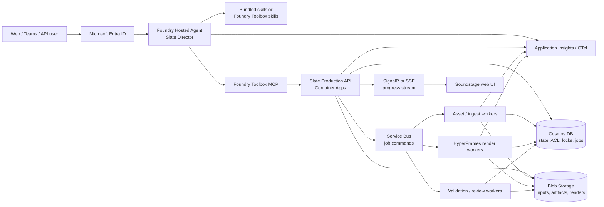

# Slate on Microsoft Foundry: Feasibility and Deployment Plan

> **Assessment date:** July 13, 2026  
> **Status:** Architecture proposal; no Azure resources were created or changed.  
> **Decision:** Build Slate as a **Foundry Hosted Director Agent backed by a separate, durable Slate Production Service**. Do not rebuild Slate in the retiring Foundry visual workflow designer, and do not put production rendering in a prompt agent.

## 1. Executive conclusion

Slate is feasible as a Microsoft Foundry agent, but the right boundary matters.

Slate is not just a prompt plus a few API calls. It combines:

- creative reasoning and just-in-time skill selection;
- a governed, checkpointed production process;
- approximately 20 local and Azure-backed tools;
- long-running FFmpeg, Node.js, headless-browser, and HyperFrames work;
- generated files that can be large and must survive across sessions;
- independent technical and creative review;
- human approval before cost-bearing or irreversible operations.

These characteristics make Slate a strong fit for a **code-based Hosted agent**, but a weak fit for a portal-only Prompt agent. They also argue against running the entire media plane inside the Hosted agent's per-session sandbox.

The recommended architecture has two planes:

1. **Director plane — Microsoft Foundry Hosted Agent**
   - Owns the conversation, creative reasoning, stage selection, skill loading, and human checkpoints.
   - Uses Microsoft Agent Framework programmatic workflows for durable orchestration.
   - Exposes the Foundry Responses endpoint for chat and optionally A2A for delegation.
   - Calls the production plane through a small set of coarse-grained, authenticated MCP or OpenAPI tools.

2. **Production plane — Slate service and workers**
   - Owns authoritative project state, tool governance, cost enforcement, job execution, artifacts, rendering, review, and delivery.
   - Runs heavy jobs on appropriately sized Azure compute instead of the Hosted agent sandbox.
   - Stores project artifacts in Azure Blob Storage and transactional state/locks in Cosmos DB.
   - Exposes idempotent job submission and status APIs, not raw filesystem paths.

This split preserves Slate's agentic creative behavior while making its strict process enforceable, resumable, secure, and usable by many people.

## 2. Terminology: four independent choices

Foundry documentation uses several setup dimensions that are easy to conflate.

### 2.1 Agent type

| Choice | What it is | Slate fit |
|---|---|---:|
| **Prompt agent** | Instructions, model, and configured tools; Foundry runs the agent with no custom runtime code. | Low as a complete Slate runtime; useful as a thin front end to a Slate service. |
| **Hosted agent** | Slate-owned Python/C# code in a Foundry-managed container, with a dedicated endpoint, identity, session sandbox, scaling, and telemetry. | High for the Director plane. |
| **Responses API from Slate's own service** | Slate runs outside Agent Service but calls Foundry models and platform tools through Responses. | High for a standalone SaaS/service option. |

Current Foundry documentation describes Prompt and Hosted agents as the two main Agent Service types. Calling the Responses API from externally hosted code is a deployment pattern, not a third managed agent type.

### 2.2 Foundry environment setup

| Setup | State ownership and networking | Recommended use |
|---|---|---|
| **Basic** | Foundry-managed state and storage; quickest start. | Short-lived development spike only. |
| **Standard, public networking** | Bring-your-own Storage, Cosmos DB, and Azure AI Search; public networking remains available. | MVP and integration testing. |
| **Standard, private networking / BYO VNet** | Same BYO resources plus controlled private network paths. | Enterprise production target. |

Standard setup aligns with Slate because Slate already requires durable project files, metadata, audit records, and explicit data ownership. A private production setup should bundle Slate skills in the agent image initially: the Foundry Skills API is preview and, as of this assessment, does not support private networking when public access is disabled.

### 2.3 Workflow technology

| Choice | Status and fit |
|---|---|
| **Foundry visual workflow designer** | Public preview and scheduled for retirement on **December 1, 2026**. Hosted agents are not supported in the designer. Do not use for new Slate architecture. |
| **Microsoft Agent Framework declarative workflow** | YAML-based, supports variables, branching, loops, function/MCP calls, and human input. Useful for a high-level process shell. |
| **Microsoft Agent Framework programmatic workflow** | Python/C# graph or functional workflow with custom executors, events, checkpointing, parallelism, and HITL. Best fit for Slate. |
| **Slate-owned workflow coordinator** | Domain state machine in the Production Service. Required even when Agent Framework is used, because project truth and cost/gate invariants must not depend on model compliance. |

Slate should use Agent Framework for conversational orchestration and a Slate-owned coordinator for authoritative production transitions. The two have different responsibilities rather than competing with each other.

### 2.4 Distribution surface

New Foundry agents receive a stable endpoint and unique Entra identity when created. Separate Agent Applications are the legacy publishing model. Distribution options include:

- the agent's OpenAI-compatible Responses endpoint;
- Microsoft 365 Copilot and Teams;
- A2A for agent-to-agent delegation;
- a Slate web application that calls the agent endpoint;
- direct service APIs for non-conversational automation.

## 3. What Foundry provides and what Slate must provide

### 3.1 Foundry-managed capabilities

- Dedicated Microsoft Entra agent identity and stable endpoint.
- Responses, Invocations, WebSocket Invocations, Activity, and preview A2A protocols.
- Per-session VM-isolated Hosted agent sandboxes.
- Persistence of `$HOME` and `/files` across idle/resume for the same session.
- Managed conversation history with the Responses protocol.
- Versioned Hosted agent deployments and traffic rollout support.
- Application Insights and OpenTelemetry integration through protocol libraries.
- Toolbox: a versioned MCP endpoint for managed tools, connections, and preview skills.
- Managed authentication options including agent identity and user OBO.

### 3.2 Important Hosted agent limits

At the time of this assessment:

- Available sandbox sizes top out at **2 vCPU / 4 GiB**.
- A session is deprovisioned after approximately **15 minutes idle** and deleted after **30 days inactive**.
- At 1 vCPU or larger, the total session disk budget is up to **20 GiB**, with roughly 20% reserved for the system. The container image, `$HOME`, and writable files share the rest.
- Hosted agents scale per session, so an oversized image or workload cost multiplies with concurrent sessions.
- Hosted agent platform tools are not injected automatically. Foundry recommends consuming them through a Toolbox MCP endpoint.
- Hosted agents and several related capabilities remain preview features; production adoption requires explicit preview-risk acceptance.

These limits are adequate for a Director process and light local work. They are risky for concurrent 1080p rendering with Node.js, Chromium, FFmpeg, large assets, and optional WebGL.

## 4. Slate's current architecture and portability

### 4.1 Strong extension seams

Slate already has several abstractions that map well to hosted agent and service patterns:

| Slate capability | Current implementation | Cloud mapping |
|---|---|---|
| Uniform tool contract | `BaseTool`, `ToolResult`, JSON input/output schemas | Agent Framework functions, MCP tool schemas, internal worker commands |
| Runtime discovery | `ToolRegistry` discovers `BaseTool` subclasses | Build-time capability manifest and service health report |
| Governed dispatch | `TracedDispatcher` checks phase contracts and records calls | Central execution policy boundary |
| Declarative composition | SCF JSON plus JSON Schema | Durable, versionable job input |
| Audit data | `decisions.jsonl`, `ledger.jsonl`, `trace.json` | Append-only event store plus immutable Blob artifacts |
| Human gates | Checkpoint protocol and Soundstage gate decisions | Agent Framework HITL plus server-side transition guards |
| Rendering boundary | `hyperframes_render` shells out to the Node renderer | Dedicated render worker image |
| JIT skill routing | `agent_skills` metadata and `skills/INDEX.md` | Local Agent Skills provider or Foundry Toolbox skills |

The live preflight on July 13, 2026 discovered 20 tools. Nineteen have non-empty input and output JSON schemas. `hyperframes_render` is the one tool whose schemas need completion before automatic MCP/OpenAPI export.

### 4.2 Current constraints that block direct multi-user deployment

#### Workflow enforcement is mostly instructional

Slate describes a strict loop, but the strictness currently lives mainly in Copilot instructions and Markdown skills. The dispatcher enforces a configured tool allow/deny contract and writes trace data; it does not by itself guarantee that:

- the user approved the current artifact;
- a cost estimate was shown before every paid call;
- required skills were loaded;
- the transition is valid for the current project state;
- the same request is not executed twice;
- concurrent writers do not corrupt project state.

A service must convert these invariants into executable transition guards.

The current `GovernanceContext.check_budget()` reports `warn` and `exceeded`
status but does not block execution. Skill-enforcement helpers similarly return
violations for an orchestrator to interpret. Phase 1 therefore needs a new
pre-execution guard that, before dispatching work:

1. verifies the requested transition is allowed from the current project state;
2. verifies the required checkpoint is resolved against the approved artifact version;
3. reserves estimated cost and rejects an over-budget call;
4. verifies required `agent_skills` consultations when policy requires them;
5. rejects duplicate idempotency keys;
6. acquires a project write lease for mutating work.

#### Filesystem state is single-user

Current project state uses `projects/<slug>/` and append-only JSONL files without cross-process locking. Sixteen of the 20 tool contracts expose path-, directory-, file-, URL-, or source-like inputs. Raw user-supplied paths cannot cross a network trust boundary.

The service must replace paths with scoped artifact references such as:

```text
artifact://{tenant_id}/{project_id}/{artifact_id}
```

Workers resolve artifact references only inside an isolated job workspace.

#### Authentication assumes a developer workstation

Several production code paths currently shell out to `az account get-access-token`, including image generation, Azure Speech, TTS fallback, transcription, Video Indexer, and image analysis. This is a **pre-deployment blocker**, not an optional hardening item. A Hosted agent or service must use `DefaultAzureCredential`/workload identity and the agent or worker managed identity. Azure CLI tokens are not a production credential provider.

#### Packaging is incomplete

- There is no Dockerfile, Hosted agent `azure.yaml`, service entry point, or deployment infrastructure in the repository.
- The Python package metadata omits some runtime dependencies used by optional production paths, including the Azure Speech SDK and document parsers installed separately by `setup.ps1`.
- The renderer requires Node.js 22+, FFmpeg, headless-browser dependencies, and post-install patching.
- The current `render/` tree is about 942 MB, of which `node_modules/` is about 890 MB, before adding the base OS, Python runtime, Chromium, and FFmpeg.

At minimum, production dependency groups need to account for
`azure-cognitiveservices-speech`, `python-pptx`, `python-docx`, `openpyxl`, and
`pypdf`, with locked versions and container-level smoke tests. A developer
workstation succeeding after `setup.ps1` is not proof that the Python package is
self-contained.

#### Slate skills are not yet Agent Skills packages

The repository contains 138 Markdown skill/reference files, but none is packaged as `<skill-name>/SKILL.md`. Foundry Agent Skills require one `SKILL.md` per skill directory with YAML front matter containing an unquoted lowercase/hyphenated `name` and a `description`.

Slate's current hierarchy and relative links remain valuable, but require a packaging layer. Uploading all 138 files as independent Foundry skills is not recommended.

#### Local-only agent capabilities do not transfer automatically

GitHub Copilot's editor tools, terminal, browser controls, and `runSubagent` are not automatically present in a Foundry Hosted agent. Slate must explicitly implement equivalents:

- file/artifact operations through the Production Service;
- research through a Foundry Toolbox web/search tool or Slate web-fetch service;
- review through an in-process reviewer agent or A2A reviewer;
- component authoring through a sandboxed code-generation/build path;
- progress and user approvals through Hosted agent events and service APIs.

#### Soundstage is an observer, not a service API

Soundstage uses a localhost `ThreadingHTTPServer`, has no authentication, polls local file mtimes, and serves project media from disk. Its path fencing is useful, but it is not a production multi-user host. The web UI can be retained after replacing its data source with authenticated project and event APIs.

## 5. Feasibility matrix

Scores are relative to preserving Slate's current quality, workflow, and enterprise goals.

| Deployment pattern | Fidelity | Time to prototype | Multi-user readiness | Production recommendation |
|---|---:|---:|---:|---|
| Prompt agent only | 1/5 | 5/5 | 3/5 | No. Cannot host Slate's local media/runtime behavior. |
| Prompt agent + remote Slate service | 4/5 | 4/5 | 4/5 | Viable thin-agent option after the service exists. |
| Foundry visual workflow | 2/5 | 3/5 | 2/5 | No. Retiring Dec. 1, 2026 and excludes Hosted agents in the designer. |
| All-in-one Hosted agent | 4/5 | 3/5 | 2/5 | Good constrained pilot; media compute and durable storage are risks. |
| Hosted Director + Slate Production Service | 5/5 | 3/5 | 5/5 | **Recommended Foundry-native target.** |
| Standalone Slate service + Responses API | 5/5 | 3/5 | 5/5 | **Recommended service/SaaS target.** Can add Hosted agent later. |

### 5.1 What an all-in-one Hosted agent pilot can prove

A pilot container can include Python 3.13, Node.js 22+, FFmpeg, Chromium dependencies, Slate, and the HyperFrames renderer. It should be limited to:

- one user/session per project;
- short videos;
- `workers=1` and conservative render settings;
- no WebGL-heavy scenes;
- external Blob upload for final artifacts;
- a hard disk quota and cleanup policy.

The pilot must measure peak RSS, CPU, scratch-disk growth, cold-start time, and render duration. It should not be treated as evidence that the same container is suitable for an open multi-user service.

## 6. Recommended target architecture



### 6.1 Director plane

Use a Python Hosted agent with Microsoft Agent Framework and the Responses protocol.

Responsibilities:

- understand intent and ask only the most blocking creative question;
- select and load the relevant Slate skills;
- create drafts for brief, script, art direction, and scene plan;
- present checkpoints and interpret user responses;
- call coarse Production Service tools;
- report progress, failures, cost, and final delivery links;
- never treat chat history as authoritative project state.

The agent reads current project state from the service before every transition. This makes a resumed conversation, Teams handoff, or agent version rollout safe.

### 6.2 Production plane

Use an authenticated API service and asynchronous workers.

Responsibilities:

- tenant/user/project authorization;
- workflow transition validation;
- idempotency and optimistic concurrency;
- budget reservation and final cost recording;
- secure artifact upload/download;
- local tool execution in isolated workspaces;
- render and review jobs;
- append-only decisions, events, and audit records;
- cancellation, retry, timeout, and cleanup.

### 6.3 Compute split

Use separate images or worker profiles:

1. **API/Coordinator image** — small Python service; no browser or renderer.
2. **Asset worker image** — Python plus document/media libraries and FFmpeg.
3. **Render worker image** — Node.js, Chromium dependencies, FFmpeg, HyperFrames, and only the Python validation/runtime pieces it needs.
4. **Review worker image** — FFmpeg/FFprobe, validators, optional Video Indexer client.

This reduces cold-start cost, blast radius, and dependency conflicts.

## 7. Enforceable production workflow

Slate should retain creative flexibility but formalize the invariants around it.

### 7.1 Suggested state model

```text
INTAKE
  -> RESEARCHING | BRIEF_DRAFTING
  -> AWAITING_BRIEF_APPROVAL
  -> SCRIPT_DRAFTING
  -> AWAITING_SCRIPT_APPROVAL
  -> ART_DIRECTION_AND_SCENE_PLAN
  -> AWAITING_SCENE_PLAN_APPROVAL
  -> AWAITING_ASSET_SPEND_APPROVAL
  -> GENERATING_ASSETS
  -> AWAITING_RENDER_APPROVAL
  -> VALIDATING_COMPOSITION
  -> RENDERING
  -> REVIEWING
  -> REVISION_REQUIRED | AWAITING_DELIVERY_APPROVAL
  -> DELIVERED | CANCELLED | FAILED
```

Not every project needs every creative activity, but every paid call, render, publish, and destructive operation has a guarded transition.

### 7.2 Transition contract

Every transition request includes:

- `tenant_id`, `user_id`, `project_id`;
- current `state_version`/ETag;
- transition name;
- idempotency key;
- referenced approved artifact versions;
- checkpoint resolution when required;
- estimated or reserved cost;
- correlation and trace IDs.

The coordinator rejects stale, unauthorized, unapproved, over-budget, or duplicate transitions before a worker sees them.

The existing `TracedDispatcher` can remain the inner tool boundary, but the new
coordinator guard must run before it. Recording a violation after a call, or
returning a budget status for another caller to interpret, is insufficient for
paid or destructive operations.

### 7.3 Agent Framework mapping

Use a programmatic functional workflow for the conversational process:

- individual activities become `@step` functions;
- `ctx.request_info()` or equivalent HITL requests implement approval pauses;
- checkpoints persist after each user-visible artifact and external job submission;
- parallel asset generation uses bounded `asyncio.gather` only for independent jobs;
- a revision loop resumes from the last approved upstream artifact;
- the workflow is exposed as an agent through the Foundry Responses host.

The service state remains the source of truth even if Agent Framework checkpoints are lost or upgraded.

## 8. Tool strategy

### 8.1 Do not expose all primitive tools directly to the model

The internal `BaseTool` registry should remain the worker capability layer. The Director should see a smaller, safer API aligned to business operations:

| Agent-facing operation | Purpose |
|---|---|
| `slate_capabilities` | Return live models, brand assets, music, and production availability. |
| `slate_project_create` | Create a tenant-scoped project and initial budget. |
| `slate_project_get` | Return state, approved artifacts, pending checkpoint, jobs, and cost. |
| `slate_artifact_put` | Save a versioned brief/script/scene-plan/SCF artifact. |
| `slate_checkpoint_resolve` | Record approve/change/reject with expected state version. |
| `slate_job_submit` | Submit an allowed ingest/asset/render/review operation after coordinator checks. |
| `slate_job_get` | Read progress, result references, cost, and errors. |
| `slate_project_cancel` | Cancel queued/running work within policy. |
| `slate_delivery_get` | Return authorized, expiring output URLs and audit summary. |

Internally, workers invoke `foundry_image_gen`, `azure_speech_tts`, `hyperframes_render`, and the remaining tools through `TracedDispatcher`.

### 8.2 MCP and Toolbox

Expose the agent-facing operations as a remote MCP server and register that server in a versioned Foundry Toolbox.

Benefits:

- central Entra/managed-identity authentication;
- versioned tool publication;
- a single endpoint for the Hosted or Prompt agent;
- optional tool search when the toolset expands;
- compatibility with other MCP clients.

For long work, use explicit `submit` and `get` operations in the first production version. Foundry Toolbox supports preview MCP tasks, but depending on preview task support in every client is unnecessary.

Tool approval metadata is advisory at the Toolbox layer: the agent runtime must enforce `require_approval`. Slate must additionally enforce the same approval in the Production Service so a direct API call cannot bypass it.

### 8.3 Authentication

- Director to Toolbox/Slate API: Hosted agent identity.
- User-sensitive downstream calls: OBO when the action requires delegated user access or per-user project authorization.
- Worker to Blob/Cosmos/Service Bus/Foundry model resources: workload managed identity.
- No Azure CLI token subprocesses.
- No keys or tokens in images or custom environment variables.
- Put unavoidable third-party secrets in Key Vault and access them through managed identity.

The Hosted agent identity proves which agent is calling; it does **not** by
itself identify the human who started the conversation. For a multi-user Slate
service, tenant and user scope must come from verified Entra/OBO claims or a
server-issued delegation token bound to those claims. Never trust a
`tenant_id`, `user_id`, project owner, or role supplied as an LLM-generated tool
argument.

Azure token audiences also remain intentionally different. Azure AI
Services/Speech paths use the Cognitive Services audience, while newer Foundry
model and Toolbox paths use `https://ai.azure.com/.default`. Both must be
acquired through managed identity credentials in production.

## 9. Skill strategy

### 9.1 Package a curated skill set

Create Agent Skills packages for the behavioral skills the Director needs, not every component reference. Initial packages:

- `slate-production-loop`
- `slate-checkpoint-protocol`
- `slate-state-and-decisions`
- `slate-topic-research`
- `slate-art-direction`
- `slate-scene-primitives`
- `slate-design-critic`
- `slate-explainer-director`
- `slate-walkthrough-director`
- `slate-social-director`
- `slate-narration-sync`
- `slate-foundry-models`

Each package should contain a compliant `SKILL.md` and only the supplementary references/assets it needs. Large component catalogs should be queryable resources, not injected skills.

### 9.2 Two delivery modes

1. **Bundled and pinned in the Hosted agent image — initial recommendation**
   - deterministic releases;
   - compatible with private networking;
   - simple rollback with agent versions;
   - no dependency on preview Skills API availability.

2. **Foundry Skills attached to a Toolbox — later option**
   - centralized versioning and promotion;
   - progressive disclosure through MCP resources;
   - reusable by other agents;
   - currently preview, same-project only, and unavailable through a private-only Foundry endpoint.

Add a packaging/validation script that converts selected Slate Markdown sources into Agent Skills packages, validates front matter and links, and records the source commit. Do not maintain independent copies by hand.

## 10. Component authoring and review

The current Copilot runtime can create project-scoped component source code. A hosted product must make this explicit.

### 10.1 Safer authoring path

- Director produces a typed scene/component brief.
- A dedicated component-author agent generates files into a job workspace.
- The build runner allows only project component files and approved dependencies.
- Static checks reject network calls, shell execution, unseeded time/randomness, and unsupported browser APIs.
- Render a limited keyframe preview in an isolated job.
- Persist the accepted component as an immutable artifact.

Do not let arbitrary generated code execute in the API or Director container.

### 10.2 Reviewer replacement

Replace the editor-only `runSubagent` dependency with two explicit reviewers:

1. **Deterministic reviewer worker** — SCF validation, media probing, timing, black/silent/frozen-frame checks, asset and governance checks.
2. **Independent reviewer agent** — consumes review evidence and scores creative/content dimensions. It can be an in-process Agent Framework agent or a separate Foundry agent invoked through A2A.

Keep reviewer identity, prompt version, evidence references, scores, and corrective actions in the production trace.

## 11. Multi-user data and security model

### 11.1 Identity and authorization

Every resource key includes tenant and project scope:

```text
tenant_id / project_id / artifact_or_job_id
```

Use Entra ID for workforce users and Entra External ID or another approved identity provider for external customers. Enforce authorization in the Slate API even when APIM or Foundry has already authenticated the caller.

`tenant_id` and `user_id` are derived from authenticated token claims and
request context, not request JSON. The request context must flow through every
repository, coordinator, job, artifact, and tool invocation without using
process-global mutable state.

Suggested roles:

- `Slate Viewer`
- `Slate Creator`
- `Slate Approver`
- `Slate Publisher`
- `Slate Administrator`

### 11.2 Storage

- Blob Storage: source uploads, intermediate assets, SCF, review evidence, renders.
- Cosmos DB: project metadata, state version, checkpoints, jobs, ACL, leases, cost reservations.
- Append-only event/decision records: immutable Blob or Cosmos append model with retention policy.
- Azure AI Search: optional searchable knowledge/brand assets, not authoritative workflow state.

The Standard Foundry setup's Storage and Cosmos resources hold Foundry-managed
agent data. Slate must use dedicated databases/containers and Blob containers
with documented ownership; it must not write directly into Foundry-managed
schemas or assume their internal layout. Reusing the same Azure accounts is an
operational decision subject to service support, isolation, throughput, and
retention requirements.

Use short-lived user-delegation URLs for uploads/downloads. Do not return server filesystem paths.

### 11.3 Concurrency and idempotency

- Optimistic concurrency with ETags on project state.
- One active mutating transition lease per project.
- Idempotency keys on all create/submit/resolve operations.
- Service Bus duplicate detection where available.
- Workers write immutable attempt outputs, then atomically promote the winning artifact reference.
- Cancellation tokens and lease expiry for abandoned jobs.

### 11.4 Resource governance

- Per-tenant and per-project budget caps.
- Concurrent job and daily generation quotas.
- Input size, media duration, scene count, render duration, and output-size limits.
- Worker CPU/memory/time limits.
- Malware scanning and media validation for uploads.
- URL allowlists and SSRF protection for web ingest.
- Prompt/content redaction in logs.
- Retention and deletion policies by tenant.

## 12. Deployment options

### Option A — Foundry-native product

Use:

- Standard Foundry project, private networking for production;
- Hosted Slate Director agent;
- bundled Slate skills initially;
- Foundry Toolbox with the Slate MCP service and selected platform tools;
- Container Apps API and job workers;
- Blob, Cosmos DB, Service Bus, Key Vault, App Insights;
- Soundstage web app over authenticated APIs;
- stable Foundry endpoint plus Teams/M365 distribution if required.

This is the recommended enterprise path.

### Option B — Standalone Slate service for any client

Run the same Production Service, plus a Slate-owned web/API Director that calls the Foundry Responses API from Container Apps. Expose:

- REST/JSON and webhook APIs;
- web application;
- direct job automation;
- optional MCP and A2A endpoints;
- optional Teams/M365 channel integration later.

This gives the strongest control over external authentication, billing, tenancy, UI, and non-conversational use. The Director code can later be packaged as a Hosted agent without rewriting the production plane.

### Option C — Thin Prompt agent over Slate service

After the Production Service exists, create a Prompt agent whose tools are only the high-level Slate MCP operations. Keep all workflow and budget enforcement server-side. This offers the lowest agent-runtime maintenance but less control over creative orchestration, local skill behavior, and component authoring than the Hosted Director.

## 13. Implementation roadmap

Estimates are directional and should be revised after the first spike.

### Phase 0 — Technical spike

Deliverables:

- a minimal Python Hosted agent using Responses;
- one bundled Slate skill;
- wrappers for `slate_capabilities` and one zero-cost tool;
- a container with Node.js, FFmpeg, renderer dependencies, and a one-scene draft render;
- measured CPU, memory, disk, cold start, and render time;
- managed-identity call to one existing Azure model endpoint;
- no Azure CLI token dependency in the tested path.

Exit criteria:

- local and remote invocation succeed;
- one checkpoint resumes correctly;
- one artifact is uploaded and downloaded through session/files or Blob;
- limits show whether an all-in-one pilot is viable.

### Phase 1 — Extract a cloud-safe Slate runtime

Code changes:

- add a credential/token-provider abstraction using `DefaultAzureCredential`;
- add `StorageBackend`, `ArtifactRef`, `ProjectRepository`, and project lock interfaces;
- implement filesystem backends to preserve local behavior;
- complete `hyperframes_render` input/output schemas;
- centralize path resolution and fence every tool workspace;
- move setup-only dependencies into explicit package extras/lock files;
- add structured logging and correlation IDs;
- add a workflow coordinator with state transition guards;
- add idempotent checkpoint and cost-reservation services.

Exit criteria:

- existing local tests pass through the abstractions;
- no production tool shells out to Azure CLI for tokens;
- concurrent transition tests cannot corrupt or double-execute a project.
- authenticated tenant/user context flows through all mutations and tool calls;
- cross-tenant project and artifact access tests fail closed;
- approval, skill, budget, idempotency, and lease guards run before tool dispatch.

### Phase 2 — Production Service MVP

Deliverables:

- authenticated API service;
- Blob and Cosmos implementations;
- Service Bus job queue;
- asset, render, and review workers;
- job status/progress events;
- coarse MCP or OpenAPI operations;
- signed delivery URLs;
- Soundstage API adapter.

Exit criteria:

- two users can run isolated projects concurrently;
- a worker restart resumes or safely retries a job;
- all paid actions require an approved checkpoint and cost reservation;
- raw paths never appear in public contracts.

### Phase 3 — Foundry Hosted Director

Deliverables:

- Agent Framework programmatic workflow;
- Responses endpoint;
- bundled, generated Agent Skills packages;
- Toolbox connection to Slate MCP;
- independent reviewer agent/A2A integration;
- Hosted agent version deployment and canary test;
- App Insights trace correlation from agent to job.

Exit criteria:

- an end-to-end video progresses through all user gates;
- reconnect/resume reads service truth and continues safely;
- a new agent version does not orphan active projects;
- tool and skill versions are captured in the audit trace.

### Phase 4 — Enterprise hardening

Deliverables:

- Standard private Foundry environment;
- private endpoints and controlled egress;
- Key Vault and least-privilege managed identities;
- tenant quotas, rate limits, retention, deletion, and legal hold as required;
- threat model, SSRF/upload/code-execution controls;
- SLOs, dashboards, alerting, backup, and disaster recovery;
- load, chaos, security, and cost tests.

Exit criteria:

- security and privacy review passes;
- restore and replay are tested;
- noisy-neighbor tests remain within SLOs;
- preview-feature risks have accepted owners and fallback plans.

### Phase 5 — Distribution

Choose one or more:

- Foundry stable endpoint for internal callers;
- Teams/Microsoft 365 publication;
- Slate web application;
- external API through API Management;
- A2A endpoint for other agents;
- Prompt-agent facade for low-code consumers.

## 14. Proposed repository changes

```text
src/slate/
  application/
    workflow.py              # authoritative transitions and guards
    project_service.py       # use cases
    checkpoint_service.py
    job_service.py
  core/
    credentials.py           # managed identity/token providers
    artifact_ref.py          # no raw paths across boundaries
    storage.py               # interfaces
    project_repository.py
    project_lock.py
    request_context.py
  service/
    api.py                    # authenticated HTTP API
    mcp_server.py             # coarse agent-facing operations
    models.py                 # Pydantic public contracts
  workers/
    asset_worker.py
    render_worker.py
    review_worker.py
  hosted_agent/
    main.py                   # Responses host
    director.py
    workflow.py               # Agent Framework orchestration

deploy/
  azure.yaml
  api.Dockerfile
  asset-worker.Dockerfile
  render-worker.Dockerfile
  hosted-agent.Dockerfile
  infra/

agent-skills/
  slate-production-loop/SKILL.md
  slate-checkpoint-protocol/SKILL.md
  ...

scripts/
  package_foundry_skills.py
  validate_agent_contracts.py
```

The exact names can change, but preserving the boundary between domain workflow, adapters, hosted agent, and workers is essential.

## 15. First proof-of-concept backlog

1. Introduce `AzureCredentialProvider` and migrate image generation, Speech, transcription, and image analysis off Azure CLI tokens.
2. Define `ArtifactRef` and wrap one path-based tool end to end.
3. Complete `HyperFramesRender.input_schema` and `output_schema`.
4. Create a minimal render-worker Dockerfile with pinned Python/Node/FFmpeg dependencies.
5. Create a Hosted agent skeleton using Agent Framework Responses hosting.
6. Package `production-loop` and `checkpoint-protocol` as two generated `SKILL.md` packages.
7. Implement in-memory/filesystem coordinator interfaces and transition tests.
8. Expose `slate_capabilities`, `slate_project_create`, `slate_project_get`, and zero-cost `slate_job_submit` through local MCP.
9. Run one-scene render and collect resource telemetry.
10. Review the measured result before provisioning the full Standard environment.

## 16. Decision log

### Recommended now

- Use a Hosted agent, not a Prompt agent, for Slate's Director.
- Keep heavy media work outside the Hosted agent sandbox for production.
- Use Agent Framework programmatic workflows, not the retiring visual designer.
- Enforce gates and costs in the service, not only in prompts/skills.
- Bundle skills for the first private-network production version.
- Use Toolbox/MCP as the agent-to-service integration boundary.
- Keep the Production Service usable without Agent Service so web/API clients can use Slate directly.

### Decisions still required before implementation

- Internal workforce only versus external customers.
- Required regions and data residency.
- Expected maximum input size, runtime, output resolution, and concurrent jobs.
- Teams/M365 requirement versus web/API first.
- Whether generated project-scoped component code is allowed in production.
- Retention, legal hold, and customer-managed-key requirements.
- Chargeback versus publisher-pays budget model.
- Preview-service risk tolerance and required GA fallback.

## 17. Authoritative references

Primary Microsoft sources used for this assessment:

1. Microsoft Foundry Agent Service overview  
   https://learn.microsoft.com/en-us/azure/foundry/agents/overview
2. Foundry Agent Service environment setup: Basic, Standard, and private networking  
   https://learn.microsoft.com/en-us/azure/foundry/agents/environment-setup
3. Hosted agents: protocols, sessions, identity, compute, storage, scaling, and Toolbox  
   https://learn.microsoft.com/en-us/azure/foundry/agents/concepts/hosted-agents
4. Hosted agent quickstart and deployment methods  
   https://learn.microsoft.com/en-us/azure/foundry/agents/quickstarts/quickstart-hosted-agent
5. Foundry visual workflows, retirement date, and migration guidance  
   https://learn.microsoft.com/en-us/azure/foundry/agents/concepts/workflow
6. Microsoft Agent Framework workflows  
   https://learn.microsoft.com/en-us/agent-framework/workflows/
7. Microsoft Agent Framework declarative workflows  
   https://learn.microsoft.com/en-us/agent-framework/workflows/declarative
8. Hosting Agent Framework agents in Foundry  
   https://learn.microsoft.com/en-us/agent-framework/hosting/foundry-hosted-agent
9. Foundry Toolbox and MCP integration  
   https://learn.microsoft.com/en-us/azure/foundry/agents/how-to/tools/toolbox
10. Foundry Agent Skills  
    https://learn.microsoft.com/en-us/azure/foundry/agents/how-to/tools/skills
11. New stable agent endpoint model and legacy Agent Application migration  
    https://learn.microsoft.com/en-us/azure/foundry/agents/how-to/migrate-agent-applications

Because several capabilities are preview and the documentation is changing quickly, revalidate limits, region support, role names, networking support, and publishing behavior immediately before implementation or Azure provisioning.