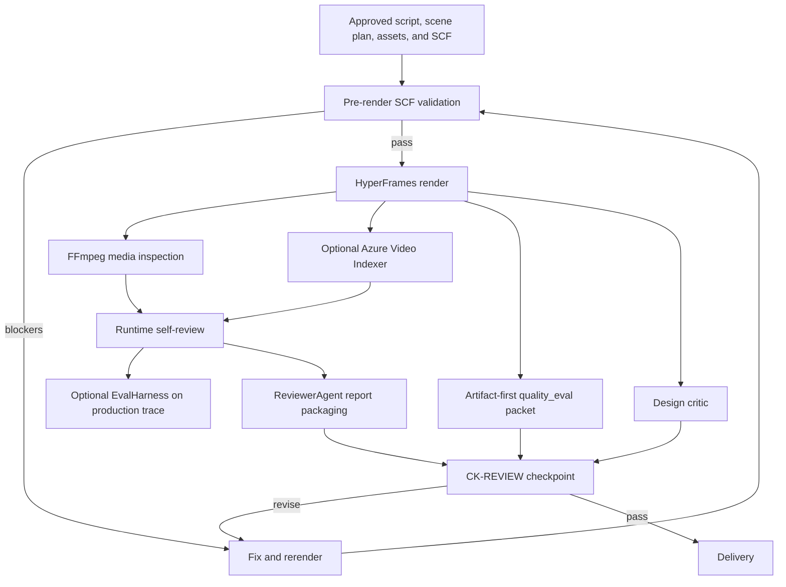

# Slate Reviewer System

## Purpose

Slate uses several review and evaluation mechanisms to decide whether a video
is ready to advance. They are related, but they are not one unified reviewer.

The system currently contains:

1. Pre-render SCF validation.
2. Local post-render media inspection.
3. Runtime self-review scoring.
4. A structured `ReviewerAgent` protocol and report format.
5. An optional Azure Video Indexer deep-review path.
6. A production-trace governance evaluator called `EvalHarness`.
7. An artifact-first visual quality packet.
8. A separate design-critic gate for creative quality.
9. A human-facing `CK-REVIEW` checkpoint.

In one sentence:

> Slate combines deterministic checks for known failure modes with an
> independent agent/human review process for judgments that code cannot make
> reliably.

---

## The Simple Mental Model

Think of the reviewer system as three questions asked at different times.

| Question | Primary mechanism |
|---|---|
| Is the planned composition structurally safe to render? | `scf_validate.py` |
| Did the MP4 render correctly? | FFmpeg inspection, `_self_review`, optional Video Indexer |
| Is the result actually good, coherent, distinctive, and ready to show? | Reviewer sub-agent, quality packet, design critic, human checkpoint |

The first two questions are mostly measurable. The third requires judgment.

---

## System Map



The normal `review_run.py` path covers the center of this diagram. It does not
automatically invoke the quality packet or design critic.

---

## 1. Pre-Render SCF Validation

The entry point is
[`scripts/lib/scf_validate.py`](../scripts/lib/scf_validate.py).

This runs after assets are generated and before rendering. It catches failures
that are cheaper to repair before spending time on an MP4.

### What it checks

- Narration audio overflowing a scene.
- Video clips shorter than the authored window.
- Video clips containing unwanted embedded audio.
- Missing image, video, narration, music, and other asset files.
- Narrated content without visible captions.
- Scenes that hold one visual too long without enough visual beats.
- Narration claims without matching same-beat visual support.
- Missing narration text needed by semantic validators.
- Narration punctuation that text-to-speech may read unnaturally.
- Unknown components or missing component prop contracts.
- Missing quality-first scene contracts.
- Bridge/transition components incorrectly used as full scenes.
- Raw text-over-image treatments that tend to produce weak slide-like output.

### Quality profiles

| Profile | Intended use | Behavior |
|---|---|---|
| `draft` | Fast iteration | Structural failures block; most quality issues remain review notes |
| `guided` | Normal authoring | Default profile; catches structural failures while coaching quality |
| `publish` | Delivery candidate | Captions, visual support, scene contracts, narration text, and other quality categories can block |
| `ci` | Strict automation | Includes publish blockers plus additional slideshow and precise-video-language requirements |

### Output

`validate_scf_pre_render()` returns a structured dictionary with:

- `passed`
- `profile`
- `blocking_issues`
- `review_issues`
- Per-category issue arrays
- A human-readable summary

### Command

```powershell
python scripts/lib/scf_validate.py `
  projects/<slug>/composition.scf.json `
  --profile publish
```

This validator is the strongest deterministic quality gate in the current
system. It checks authored intent and actual asset metadata before render.

---

## 2. Local Post-Render Media Inspection

The implementation is
[`scripts/lib/video_inspect.py`](../scripts/lib/video_inspect.py).

It uses local FFmpeg commands, so it is free and does not upload the video.

### Inspection functions

| Function | Evidence produced |
|---|---|
| `extract_sample_frames()` | Evenly spaced PNG frames for visual inspection |
| `detect_black_frames()` | Black or blank timeline sections |
| `detect_frozen_frames()` | Repeated identical-frame sections |
| `probe_audio_levels()` | Mean volume, peak volume, and silence ranges |
| `inspect_video()` | Combined report and issue list |

### Strengths

- Fast and local.
- Objective timing and audio measurements.
- Good at detecting failed assets, gaps, clipping risk, and long silence.
- Produces frame evidence that another reviewer can inspect.

### Limits

- FFmpeg cannot understand whether a static hold is intentional.
- It cannot determine whether a factual claim is correct.
- It cannot reliably judge visual design, story coherence, or brand meaning.
- Frozen-frame detection overcalls deliberate component and image holds.

Higher-level review must interpret these signals in scene context.

---

## 3. Runtime Self-Review

The main scoring function is
[`_self_review()`](../scripts/slate_render.py#L339).

Despite its older docstring referring to six dimensions, the current runtime
normally emits eight scores:

| Runtime dimension | Current implementation |
|---|---|
| `brand_compliance` | `3` when a brand package name exists; otherwise `2` with a warning |
| `pacing` | Compares total duration with target duration |
| `content_coverage` | Uses scene-count thresholds |
| `narration_timing` | Probes narration files and checks scene overflow when paths resolve |
| `audio_quality` | Uses mean/peak volume and silence ranges |
| `visual_consistency` | Uses freeze/black-frame evidence plus SCF semantic validators |
| `caption_accuracy` | Uses Video Indexer transcript overlap when available; otherwise usually capped at `2` |
| `content_redundancy` | Computes pairwise narration word-overlap ratios |

### Verdict rule

The self-review verdict is `FAIL` when:

- Any dimension scores `1`, or
- The total score is below 67 percent of the maximum.

Otherwise it returns `PASS`.

### Additional checks

The function also:

- Warns when motion style is missing or inconsistent.
- Records scenes that used generation fallbacks.
- Checks synthetic product-surface body contracts.
- Calls local video inspection.
- Optionally calls Azure Video Indexer.
- Reuses SCF caption, visual-hold, visual-support, and narration-text validators.
- Produces suggested corrective actions for dimensions that scored `1`.
- Optionally runs `EvalHarness` when a production trace exists.

### Returned structure

The result includes:

- `verdict`
- `scores`
- `total` and `max_total`
- `warnings`
- Inspection evidence
- Optional `eval_harness` result
- `fixes_needed`

---

## 4. ReviewerAgent Protocol

The protocol and data types live in
[`src/slate/agents/__init__.py`](../src/slate/agents/__init__.py).

`ReviewerAgent` is not itself an LLM or autonomous process. It provides:

- Review types: script, asset, and final.
- Finding severities: info, suggestion, warning, and blocker.
- Revision owners: script, assets, compose, or human.
- A review-context payload for a sub-agent.
- A structured `ReviewReport`.
- Finding routing by category.
- Pass/fail threshold logic.
- Parsing support for a sub-agent response.

### Report pass rule

`ReviewerAgent.create_report()` passes only when:

- No blocker findings exist.
- Every supplied score is at least `min_dimension_score`, normally `2`.
- The supplied scores total at least `min_total_score`, normally `14`.

### Skill bundle

For final review, the context includes the full text of these reviewer skills:

- [`skills/meta/reviewer-operating-model.md`](../skills/meta/reviewer-operating-model.md)
- [`skills/meta/review-evidence-collection.md`](../skills/meta/review-evidence-collection.md)
- [`skills/meta/review-blocker-taxonomy.md`](../skills/meta/review-blocker-taxonomy.md)
- [`skills/core/video-indexer-review.md`](../skills/core/video-indexer-review.md)
- Render-audit and checkpoint guidance

This makes the review expectations explicit and portable to a reviewer
sub-agent.

### Important implementation fact

The normal runtime does not send evidence to an LLM through `ReviewerAgent`.
It creates a report immediately from `_self_review` scores. True independence
comes from the outer Copilot workflow launching a separate `runSubagent` that
inspects the artifacts and interprets the report.

---

## 5. Standalone Review CLI

The primary entry point is
[`scripts/review_run.py`](../scripts/review_run.py).

### Execution flow

1. Load a scenario JSON or infer a scenario-like structure from SCF.
2. Probe the rendered MP4 duration.
3. Call `_self_review()`.
4. Call `_run_review_stage()`.
5. Build findings from every score below `3` and every warning.
6. Write review artifacts.
7. Exit `0` on pass or `1` on revise.

### Command

```powershell
python scripts/review_run.py `
  --video projects/<slug>/renders/final.mp4 `
  --scf projects/<slug>/composition.scf.json `
  --output-dir projects/<slug>/review-final
```

### Written artifacts

| File | Purpose |
|---|---|
| `review_context.json` | Artifacts, trace metrics, required skills, thresholds, and action contract |
| `review_report.json` | Machine-readable scores, findings, owners, blockers, warnings, and verdict |
| `review_report.md` | Concise human-readable report for `CK-REVIEW` |

### Failure handling

In the legacy `slate_render.py` path, a failed report adds:

- `needs_rerender: true`
- `fixes_needed`
- An `agent_next_action` instructing the caller to validate findings, fix the
  valid issues, and rerun review

The renderer does not automatically repair and rerender. The calling agent owns
the corrective loop.

---

## 6. Optional Azure Video Indexer Review

The tool is
[`src/slate/tools/analysis/video_indexer.py`](../src/slate/tools/analysis/video_indexer.py).

When configured, Video Indexer can provide:

- OCR text found on frames.
- Speech transcript segments.
- Detected scene boundaries.
- Audio effects such as silence and music.
- Moderation signals.
- Keywords and faces.

### How runtime scoring uses it

- Transcript overlap can raise or lower `caption_accuracy`.
- Detected scene-count drift can lower `visual_consistency`.
- Detected silence can lower `audio_quality`.
- Moderation findings are surfaced as warnings for review.

### What it does not replace

- FFmpeg freeze detection.
- Arbitrary frame sampling.
- Brand-color and font verification.
- Human visual judgment.
- Factual source verification.

When Video Indexer is unavailable, review continues with local heuristics.

---

## 7. EvalHarness: Production Governance Evaluation

[`src/slate/core/eval_harness.py`](../src/slate/core/eval_harness.py) evaluates
the production trace rather than the MP4.

Its six dimensions are:

1. `budget_compliance`
2. `tool_governance`
3. `stage_completeness`
4. `gate_compliance`
5. `duration_compliance`
6. `violation_severity`

Each dimension receives `1`, `2`, or `3`. The verdict fails when any dimension
scores `1` or the aggregate falls below 67 percent.

```powershell
python -m slate.core.eval_harness projects/<slug>/trace.json
```

The CLI writes a sibling `.eval.json` report.

### Important separation

`EvalHarness` answers "was the production run governed?" It does not answer
"is the MP4 visually good?"

In `_self_review`, an `EvalHarness` result is attached and printed, but its
failure currently does not force the main video-review verdict to fail.

---

## 8. Artifact-First Quality Eval Packet

[`scripts/quality_eval.py`](../scripts/quality_eval.py) is a separate,
quality-first evaluation path. It is used heavily by the `quality-first-evals`
and `quality-wave-2` projects.

### What it does

1. Runs pre-render SCF validation.
2. Inspects the MP4 with FFmpeg.
3. Extracts multiple frames from every scene.
4. Computes basic image metrics.
5. Classifies freezes using SCF scene context.
6. Detects blank frames and missing frame extraction.
7. Measures structured-visual occupancy and edge contact.
8. Detects dark-blue/slate visual sameness unless explicitly allowed.
9. Writes JSON and Markdown packets for human frame review.

### Verdicts

- `PASS`
- `PASS_WITH_REVIEW`
- `FAIL_TO_RENDER`
- `FAIL_TO_PUBLISH`

### Command

```powershell
python scripts/quality_eval.py `
  --video projects/<slug>/renders/final.mp4 `
  --scf projects/<slug>/composition.scf.json `
  --output-dir projects/<slug>/quality-eval `
  --profile publish
```

### Artifacts

- `quality_eval.json`
- `quality_eval.md`
- Global sample frames
- Per-scene sample frames

The Markdown report intentionally leaves space for human notes. Pixel metrics
can identify suspicious frames; they cannot decide whether the visual idea is
appropriate or compelling.

---

## 9. Design Critic

The design-quality contract is
[`skills/creative/design-critic.md`](../skills/creative/design-critic.md).

This exists because the technical reviewer checks correctness but cannot
reliably detect generic, template-like, or poorly art-directed output.

### Per-scene axes

- PowerPoint-like composition, where `3` means no slide-deck smell.
- Premium design signals.
- Art-direction adherence.
- Distinctiveness.
- Reliability.

### Video-level gates

- No dominant repeated technique across more than roughly one third of scenes.
- No adjacent scenes with the same primary technique.
- Distinct primary subjects across scenes.
- No default component styling as the video's visual identity.
- The signature motif cannot become the hero of every scene.
- Captions should not amateurishly duplicate headline text.
- At least one scene should let the visual medium enact the story.
- Music, captions, and visual texture must be intentionally accounted for.

### Artifact

The critic writes `projects/<slug>/design-review.json` with per-scene scores,
technique inventory, fixes, and a one-line visual fingerprint.

This gate is procedural and evidence-based: render keyframes, inspect them,
score them, revise, and persist the result.

---

## 10. Human CK-REVIEW

[`skills/meta/checkpoint-protocol.md`](../skills/meta/checkpoint-protocol.md)
defines the final human-facing review checkpoint.

It should show:

- PASS or REVISE.
- The dimension score table.
- Blocking findings and corrective actions.
- The review report path.
- Any material evidence gaps or overrides.

If review fails, the main agent must fix, rerender, and review again before
delivery. A human can explicitly override a finding, but the override should be
recorded in the append-only decision log.

---

## 11. Scoring Contracts and Current Drift

The repository currently has several definitions of the reviewer dimensions.

| Source | Declared dimensions |
|---|---|
| `ReviewerAgent.DEFAULT_DIMENSIONS` | 6: brand, captions, audio, visuals, pacing, content accuracy |
| `governance-policy.yaml` | 7: the six above plus content redundancy |
| Runtime `_self_review()` | 8: brand, pacing, coverage, narration timing, audio, visuals, captions, redundancy |
| Production-loop documentation | 8 runtime dimensions |
| Architecture reviewer table | 8, but substitutes content accuracy for content coverage |

The runtime report therefore does not exactly implement either the
`ReviewerAgent` default or the governance YAML review policy.

The most important consequence is that runtime `_self_review()` does not score
`content_accuracy`, even though the policy and reviewer operating model require
it.

---

## 12. Finding Severity and Routing

A finding has:

- Category.
- Description.
- Severity.
- Revision owner.
- Optional scene ID.
- Optional suggested fix.

Typical routing is:

| Root cause | Owner |
|---|---|
| Factual error, tone, script length | `script` |
| Brand color, font, logo, image quality | `assets` |
| Timing, captions, audio, transitions | `compose` |
| Safety, compliance, rights | `human` |

The owner should identify the stage that must change, not merely the stage
where the problem became visible.

---

## 13. Worked Artifact Example

[`projects/evals-explainer/review_report.json`](../projects/evals-explainer/review_report.json)
is a useful example of the normal runtime report.

It passed at `21/24` with:

- Brand compliance: `2`
- Pacing: `3`
- Content coverage: `3`
- Narration timing: `3`
- Audio quality: `3`
- Visual consistency: `2`
- Caption accuracy: `2`
- Content redundancy: `3`

The same report carried warnings for 87 frozen sections and 75 percent scene
count drift. The runtime treated these as review signals rather than blockers
because the video was component-heavy and static holds can be intentional.

This demonstrates why raw detector output must be interpreted rather than
blindly converted into failure.

For a creative-quality example, see
[`projects/pal-mage/mage-1min/design-review.json`](../projects/pal-mage/mage-1min/design-review.json).
It records a separate five-axis design review for each scene and documents a
specific revision made before delivery.

---

## 14. Current Implementation Gaps

### The standalone reviewer is not independently scoring

`review_run.py` calls `_self_review()` and then immediately passes those same
scores to `ReviewerAgent.create_report()`. The structured reviewer context is
written to disk, but the runtime report is not produced from a fresh LLM review.

The outer `runSubagent` workflow is what provides independent judgment.

### Content accuracy is not in the runtime score

The runtime checks coverage and redundancy but not factual correctness against
`research.md` or source documents.

### SCF narration normalization loses evidence

When `review_run.py` loads a normal SCF narration path represented as a string,
it normalizes the narration value to an empty string. It also does not preserve
the scene's separate `narrationText` field in that normalized scenario.

This weakens standalone narration-overflow, redundancy, and semantic visual
support checks. Pre-render SCF validation remains the main protection.

### EvalHarness failure is non-blocking to video review

A failed governance evaluation is attached to the result but is not included
in the main review verdict calculation.

### Brand review is shallow in `_self_review`

Brand compliance is primarily based on whether a brand package name exists,
not on rendered colors, fonts, logo placement, and legal text.

### Caption accuracy is only partially measured

Video Indexer transcript overlap primarily measures whether expected narration
was heard. It does not directly prove that burned captions appeared at the
right time with the right text and styling.

### Quality eval and design critic are not orchestrated by `review_run.py`

The operating model requires them alongside technical review, but the normal
review CLI does not automatically call either one.

### Required-dimension completeness is not validated

`ReviewerAgent.create_report()` checks only the scores it receives. It does not
reject a report because a required dimension is absent.

### Some warning categories route to `unknown`

Runtime dimensions such as narration timing and content redundancy do not have
complete category mappings in `_build_reviewer_findings()`, so findings can
default to the compose owner without a precise category.

---

## 15. Verification Status

As of July 27, 2026:

- 40 focused tests for `ReviewerAgent`, `EvalHarness`, and `quality_eval.py`
  pass.
- `tests/test_self_review_surfaces.py` currently fails during collection
  because its `live_subtitles` test stub does not include the newer
  `load_word_sidecar` symbol imported by `slate_render.py`.
- The checkout contains 41 runtime review bundles.
- It contains 18 quality-eval packets.
- It contains 7 design-review artifacts.
- No persisted EvalHarness `.eval.json` artifacts were found under `projects/`
  or `output/` during the inspection.

That usage pattern suggests:

- Runtime technical review is established.
- Artifact-first visual evaluation is used mainly in dedicated quality suites.
- Design critique is applied selectively rather than universally.
- Trace-governance evaluation exists as a tested capability but is not
  consistently persisted in production projects.

---

## 16. Recommended Unified Review Sequence

The current pieces are most effective when used in this order:

1. Run SCF validation with the `publish` profile.
2. Fix all structural and publish blockers.
3. Render the MP4.
4. Run `quality_eval.py` to create frame evidence and classify technical
   failures.
5. Run `review_run.py` for the runtime score and routed findings.
6. Run the design critic against per-scene keyframes and the final cut.
7. Give all artifacts to an independent reviewer sub-agent.
8. Reconcile disagreements between automated evidence and reviewer judgment.
9. Fix valid blockers, rerender, and rerun the same checks.
10. Present one consolidated `CK-REVIEW` to the user.

This sequence preserves the strengths of each evaluator without pretending
that any one of them can judge the whole video.

---

## Summary

Slate's reviewer system is best understood as a layered evidence system:

1. **SCF validation** checks whether the authored plan is safe to render.
2. **FFmpeg inspection** measures the rendered media.
3. **Video Indexer** optionally adds transcript, OCR, scene, and moderation
   evidence.
4. **Runtime self-review** converts selected signals into scores and fixes.
5. **ReviewerAgent** provides a structured report and routing contract.
6. **EvalHarness** evaluates production governance separately from video
   quality.
7. **Quality eval** creates scene-level visual evidence for human review.
8. **Design critic** evaluates authorship, variety, and art direction.
9. **The reviewer sub-agent and human checkpoint** make the final judgment.

The architecture is strongest when deterministic tools provide evidence and
independent reviewers interpret that evidence. Automated PASS should mean "no
known machine-detectable blocker," not "the video is unquestionably good."